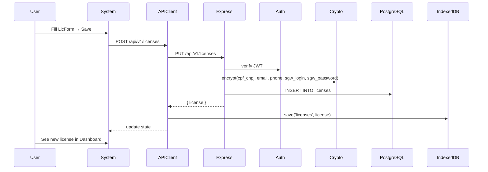
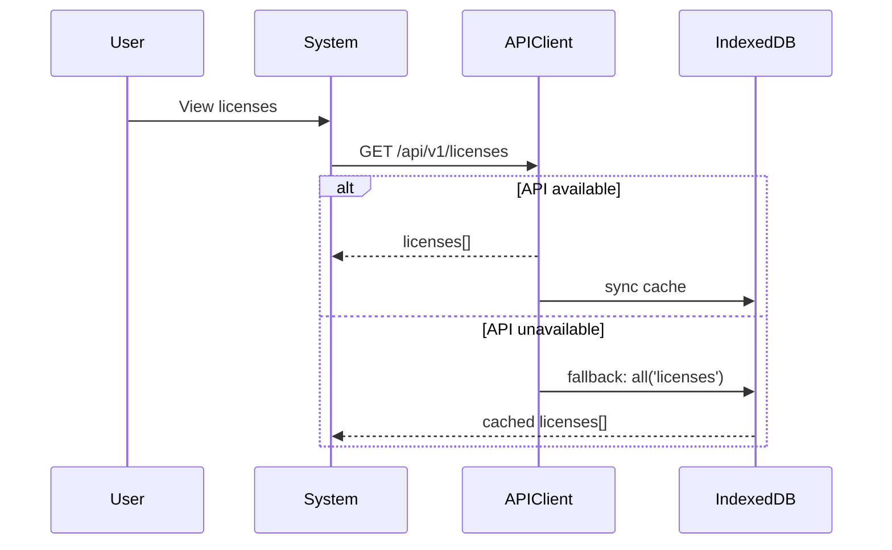

# SGW Pro — System Stack & Architecture

## Overview

SGW Pro is a **browser-based license management system** for Stellantis SGW (Secure Gateway) automotive scanners. Single-page application with offline-first architecture, server-side encrypted storage, and AI-powered certificate extraction.

---

## Architecture Diagram

```mermaid
flowchart TD
    U((User)) --> |Chrome/Edge| SPA[SPA: sgw_pro.html]
    SPA --> |CDN| B[Babel Standalone]
    SPA --> |CDN| R[React 18 + ReactDOM]
    SPA --> |CDN| TW[Tailwind CSS]
    SPA --> |CDN| JP[jsPDF + html2canvas]
    SPA --> |CDN| QR[QRCode.js]
    SPA --> |CDN| PJ[PDF.js]
    SPA --> |API REST| API[Express API :3001]
    SPA --> |Sync| IDB[(IndexedDB SGWPro8 v4)]
    SPA --> |Backup| FSA[File System Access API]
    SPA --> |Proxy| AI[/api/ai-proxy]
    SPA --> |Cache| SW[Service Worker]
    
    API --> |pg| PG[(PostgreSQL 16)]
    API --> JWT[JWT Auth]
    API --> ENC[AES-256-GCM + PBKDF2]
    API --> AUD[Audit Logs]
    
    AI --> |Anthropic| CLAUDE[Claude Opus 4.5]
    
    subgraph Docker
        NX[nginx:alpine :8081]
        API
        PG
        AM[mock-api :3000]
    end

    subgraph Vercel
        V_HTML[sgw_pro_final_v11.html]
        V_AI[ai-proxy.ts → Anthropic]
    end
```

---

## Technology Stack

### Frontend — Single-File SPA (~4654 lines)

| Layer | Technology | Version | Notes |
|-------|-----------|---------|-------|
| Framework | React (UMD) | 18.2.0 | No build step, Babel standalone transpiles JSX at runtime (1-2.5s) |
| Transpiler | Babel Standalone | 7.23.10 | `data-type="module"` + `type="text/babel"` |
| Styling | Tailwind CSS (standalone) | latest | CDN via cdn.tailwindcss.com |
| Fonts | Inter, Chivo, Bebas Neue, JetBrains Mono | - | Google Fonts |
| PDF | jsPDF | 2.5.1 | A4 generation with html2canvas screenshots |
| Screenshot | html2canvas | 1.4.1 | Scale 3, JPEG 0.95 quality |
| QR Code | qrcodejs | 1.0.0 | UMD browser build |
| Spreadsheet | SheetJS (xlsx) | 0.18.5 | Import/export |
| PDF Parse | PDF.js | 3.11.174 | Text extraction for AI pipeline |
| ZIP | JSZip | 3.10.1 | Batch extractor |
| Crypto (legacy) | CryptoJS | 4.2.0 | SHA-256 only (encrypt/decrypt are no-ops) |
| Service Worker | sw.js | v3 | Network-first strategy |
| Offline DB | IndexedDB | SGWPro8 v4 | Fallback when API unavailable |

### Backend — Express API

| Layer | Technology | Version | Notes |
|-------|-----------|---------|-------|
| Runtime | Node.js | 20 (alpine) | Docker |
| Framework | Express | 4.21.2 | Helmet, CORS, rate-limit |
| Database | PostgreSQL | 16 (alpine) | Docker |
| Auth | jsonwebtoken + bcrypt | 9.x / 6.x | JWT 24h, httpOnly cookie + Bearer |
| Encryption | Node crypto (AES-256-GCM) | native | PBKDF2 SHA-512, 600k iterations |
| Validation | express-validator | 7.3.2 | Input sanitization |
| IDs | uuid | 11.1.0 | Gen random UUIDs |

### Infrastructure

| Layer | Technology | Notes |
|-------|-----------|-------|
| Docker | docker-compose | 4 services: postgres, api, sgw-pro, ai-mock |
| Web Server | nginx:alpine | Reverse proxy + CSP + gzip |
| Vercel | Serverless | ai-proxy.ts (Anthropic) + static HTML |
| CI/CD | Manual | docker-compose up --build / vercel deploy |

---

## Component Tree

```
App
├── LoginPage                  # Auth form (username + password)
└── System (CRM)               # Authenticated app shell
    ├── Sidebar                # Navigation (8 views, 3 categories)
    ├── TopBar                 # Search (Cmd+K), user menu, backup status
    └── Views
        ├── Dashboard          # Recent licenses + urgent renewals table
        ├── LicForm            # License create/edit form with images
        │   ├── EquipModal     # Equipment selector grid
        │   └── LicModal       # License picker for renewals
        ├── Clients            # Full license table (sort, filter, search)
        ├── Financial          # MRR/ARR stats + renewals table
        ├── Reports            # (placeholder/static)
        ├── Audit              # Audit log table
        ├── Settings           # Backup config + API health + theme
        └── ExtractorBatch     # Batch certification via ZIP/PDF/AI
            └── CertPDF        # 3-tab A4 PDF preview (License/Evidence/Terms)
            └── CertLink       # QR Code + shareable verification link
```

---

## Data Flow

### License CRUD (happy path)



### AI Extraction

```mermaid
sequenceDiagram
    User->>ExtractorBatch: Upload ZIP/PDF
    ExtractorBatch->>PDF.js: Parse PDF → text + base64
    ExtractorBatch->>/api/ai-proxy: POST (base64 PDF)
    /api/ai-proxy->>Anthropic: POST /v1/messages (Claude Opus 4.5)
    Anthropic-->>/api/ai-proxy: extracted fields (JSON)
    /api/ai-proxy-->>ExtractorBatch: parsed result
    ExtractorBatch->>System: Populate LicForm with extracted data
```

### Offline Fallback



---

## Database Schema (PostgreSQL)

### `licenses` — Core table (18 columns)
- `id` TEXT PK, `license_key` UNIQUE, `validation_hash` TEXT (SHA-256)
- `customer_name`, `cpf_cnpj`🔒, `email`🔒, `phone`🔒, `equipment`, `equipment_serial`
- `region`, `sgw_login`🔒, `sgw_password`🔒, `activation_date`, `valid_until`
- `technician`, `status` [pending|active|expired|revoked], `device_fingerprint`
- `brands` JSONB, `observations`, `pdf_source`, `has_cert`
- `created_at`, `updated_at`

🔒 = encrypted with AES-256-GCM + PBKDF2 (600k iterations)

### Supporting tables
- `images` — Base64 screenshots (1-8 per license, FK cascade)
- `audit_logs` — Immutable action log (entity_type, action, actor, metadata JSONB)
- `config` — Key-value settings (JSONB value)
- `users` — Admin auth (bcrypt password hash)

---

## Security Architecture

```
┌─────────────────────────────────────────────────────────────┐
│                     Browser (Client)                        │
│  ┌─────────┐  ┌──────────┐  ┌───────────────────────────┐  │
│  │localStor│  │IndexedDB │  │ Session (in-memory)       │  │
│  │sgw_token│  │licenses* │  │ licenses[], config, auth  │  │
│  │sgw8_eq  │  │images*   │  │                           │  │
│  └─────────┘  └──────────┘  └───────────────────────────┘  │
│  * plaintext when API unavailable                           │
│  S.enc/S.dec = no-ops (server-side only)                   │
└──────────────────────┬──────────────────────────────────────┘
                       │ HTTPS (Docker/Vercel)
                       │ Bearer token + httpOnly cookie
┌──────────────────────▼──────────────────────────────────────┐
│                    Express API (Docker)                     │
│  ┌──────┐  ┌──────────┐  ┌───────────┐  ┌──────────────┐  │
│  │JWT   │  │Crypto    │  │Helmet     │  │Rate Limit    │  │
│  │24h   │  │AES-256-  │  │CSP + HSTS │  │10/auth       │  │
│  │http- │  │GCM       │  │XSS/CSRF   │  │200/rest      │  │
│  │only  │  │PBKDF2    │  │protection │  │              │  │
│  └──────┘  └──────────┘  └───────────┘  └──────────────┘  │
│  encrypt BEFORE write → decrypt AFTER read                 │
│  Fields: cpf_cnpj, email, phone, sgw_login, sgw_password   │
└──────────────────────┬──────────────────────────────────────┘
                       │
┌──────────────────────▼──────────────────────────────────────┐
│                PostgreSQL 16 (Docker)                       │
│  Encrypted fields at rest (AES-256-GCM ciphertext)         │
│  Passwords bcrypt-hashed                                   │
└─────────────────────────────────────────────────────────────┘
```

---

## Key Architectural Decisions

| Decision | Rationale | Tradeoff |
|----------|-----------|----------|
| Single-file HTML + UMD CDNs | Zero build step, instant deploy | ~1-2.5s Babel transpile; no code splitting |
| Server-side encryption | Key never leaves server | Offline IDB data is plaintext |
| IndexedDB fallback | Offline-first in remote shops | Duplicate data; sync conflicts |
| JWT 24h + httpOnly cookie | Balance security and UX | Token rotation not implemented |
| File System Access API | Native folder backup UX | Chrome/Edge only; requires HTTPS |
| No React Router | Simple state machine (`nav` string) | No deep linking; no code splitting per route |
| Babel runtime transpile | Avoid build tooling entirely | No TypeScript; errors crash silently |

---

## Possible Improvements

### CRITICAL 🔴

| # | Improvement | Impact | Effort | Notes |
|---|-------------|--------|--------|-------|
| 1 | **Build step** (Vite/Rollup) | Eliminate Babel runtime overhead (1-2.5s), enable TypeScript, code splitting | Medium | Largest UX improvement possible. Enables tree-shaking, removes `unsafe-eval` CSP requirement |
| 2 | **Proper CSP without `unsafe-eval`** | Security hardening (XSS mitigation) | High | Blocked by Babel standalone + Tailwind CDN. Requires build step |
| 3 | **Token rotation + refresh tokens** | Security: 24h JWT never refreshed | Low | Add `POST /auth/refresh` with short-lived access + long-lived refresh token |
| 4 | **Encrypt IndexedDB offline data** | Plaintext CPF/CNPJ/login/pw when offline | Medium | Derive key from password with Web Crypto API + PBKDF2 |

### HIGH 🟠

| # | Improvement | Impact | Effort | Notes |
|---|-------------|--------|--------|-------|
| 5 | **Loading skeletons** | Perceived performance during data fetch | Low | Already partially implemented |
| 6 | **CDN integrity SRI auto-check** | Ensure CDN files aren't compromised | Low | Manual hash update on version bump is error-prone |
| 7 | **Rate limiting per-user** (not per-IP) | Prevents brute force behind NAT | Medium | Currently IP-based only |
| 8 | **API pagination on all list endpoints** | Performance with 10k+ licenses | Low | Already partially implemented |
| 9 | **Splash screen during Babel transpile** | UX: users see blank white screen for 1-2.5s | Low | CSS `#splash` with loading indicator |
| 10 | **HSTS preload** | Force HTTPS at browser level | Low | `Strict-Transport-Security: max-age=31536000; includeSubDomains; preload` |

### MEDIUM 🟡

| # | Improvement | Impact | Effort | Notes |
|---|-------------|--------|--------|-------|
| 11 | **Table virtual scrolling** (react-window) | DOM perf with 500+ licenses | Medium | Currently renders all rows |
| 12 | **Keyboard navigation audit** | WCAG 2.2 AA compliance | Low | Partially done (sidebar, tables, modals) |
| 13 | **screenReaderStatus announcements** | Accessibility for view transitions | Low | SPA focus management done, but aria-live regions needed |
| 14 | **Image optimization** | Reduce PDF cert size | Low | Screenshots at scale 3 → large JPEGs |
| 15 | **Automatic audit retention** | DB doesn't grow unbounded | Low | Add configurable TTL + auto-cleanup |
| 16 | **requestId per API call** | Debugging/tracing requests | Low | UUID middleware + response header |
| 17 | **Nginx healthcheck hardening** | Production readiness | Low | Currently just HTTP 200 check |
| 18 | **Unify .env files** | 3 .env files with different keys | Low | `.env`, `.env.local`, `.env.example` overlap |

### LOW 🟢

| # | Improvement | Impact | Effort | Notes |
|---|-------------|--------|--------|-------|
| 19 | **translate="no" on serials/CPFs** | Prevent browser translation glitches | Low | Add to license keys and document numbers |
| 20 | **aria-sort on table headers** | Screen reader sort announcements | Low | Sort via `<select>`, not headers |
| 21 | **Close button aria-label consistency** | Screen reader clarity | Low | Audit all modals |
| 22 | **`SELECT *` → explicit columns** | SQL best practice, minor perf | Low | Some routes still use `SELECT *` |
| 23 | **Docker layer caching** | Faster rebuilds | Low | Separate `COPY package*.json` + `npm ci` from `COPY src/` |
| 24 | **WebSocket for real-time sync** | Multi-tab consistency | Medium | Currently polling/storage event |
| 25 | **Desktop PWA manifest** | "Install" prompt on Chrome | Low | No manifest.json or icons defined |

---

## Glossary

| Term | Definition |
|------|------------|
| SGW | Secure Gateway — Stellantis anti-theft gateway module |
| SGW Pro | License management system for SGW scanner tools |
| CertPDF | A4 certificate PDF with 3 tabs (License/Evidence/Terms) |
| CertLink | QR Code + verification payload for certificates |
| ExtractorBatch | AI batch extractor — PDF/ZIP → Claude → structured data |
| licenseKey | 5-segment serial key (e.g. ABR-2026-K7MN-P3QR-T8XY) |
| validationHash | SHA-256 of licenseKey for offline verification |
| PIMG | Global base64 image constants for certificate branding |
| idb | IndexedDB offline store (SGWPro8 v4) |

---

## Reference Index

| Component | File | Key Symbols |
|-----------|------|-------------|
| SPA Entry | `sgw_pro.html` | `<App>`, `<System>`, `<LoginPage>` |
| Auth Client | `sgw_pro.html:322-361` | `APIClient`, `login()`, `setToken()` |
| Offline DB | `sgw_pro.html:366-395` | `class DB`, `save()`, `get()`, `all()` |
| Backup | `sgw_pro.html:403-512` | `BackupSvc`, `pickDir()`, `writeBackup()` |
| Security Helpers | `sgw_pro.html:280-291` | `S.maskDoc()`, `S.enc()`, `S.dec()` |
| License Engine | `sgw_pro.html:296-303` | `L.gen()`, `L.hash()`, `L.days()` |
| CertPDF | `sgw_pro.html:889-1191` | `<CertPDF>`, jsPDF + html2canvas |
| CertLink | `sgw_pro.html:1196-1292` | `<CertLink>`, QR Code payload |
| ExtractorBatch | `sgw_pro.html:1297-1758` | `<ExtractorBatch>`, AI + regex modes |
| Express Setup | `api-server/src/index.js` | `app`, `routes`, `seedAdmin()` |
| DB Pool | `api-server/src/db.js` | `query()`, `transaction()` |
| Crypto | `api-server/src/crypto.js` | `encrypt()`, `decrypt()`, `hash()` |
| Auth Middleware | `api-server/src/middleware/auth.js` | `auth()`, `generateToken()` |
| Routes: Auth | `api-server/src/routes/auth.js` | `POST /login`, `/register`, `/logout` |
| Routes: Licenses | `api-server/src/routes/licenses.js` | CRUD + images + stats |
| Routes: Audit | `api-server/src/routes/audit.js` | `GET/POST /` |
| Routes: Config | `api-server/src/routes/config.js` | `GET/PUT /` |
| Routes: Backup | `api-server/src/routes/backup.js` | `POST /export`, `/import` |
| Routes: Stats | `api-server/src/routes/stats.js` | MRR, ARR, counts |
| DB Schema | `sql/init.sql` | `licenses`, `images`, `audit_logs`, `config`, `users` |
| nginx | `nginx.conf` | CSP, proxy_pass, security headers |
| Service Worker | `sw.js` | Cache `sgw-pro-v3`, network-first |
| Landing | `index.html` | Hub landing page |
| Vercel AI | `api/ai-proxy.ts` | Anthropic proxy, CORS validation |
| Build Script | `pdf_extracted_imgs/build_v11.py` | PIMG injection, CertPDF update |
